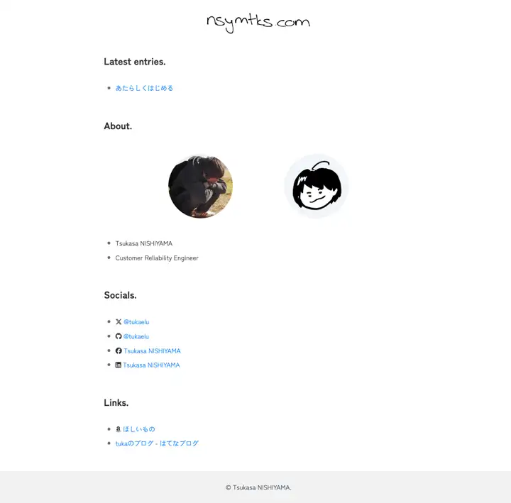

思った以上に疲労困憊な日が続いていてアウトプットを全くできていないのだけれども、とりあえずサイトのデザインをまるっと変えてみた。

**before**

記事のコンテンツも以前はMarkdownをファイルでGit管理していたけど、日本製のヘッドレスCMSのひとつである[Newt](https://www.newt.so/)を使ってみることにしたのと、一部使っていたSvelteは完全に排除した。

## Newtとは？

  

    <a
      href="https://www.newt.so"
      data-iframely-url="//cdn.iframe.ly/api/iframe?url=https%3A%2F%2Fwww.newt.so%2F&key=878c5bef402f0b2911bf6d4ce6261abd"
    >
      コンテンツ管理の新しいスタンダード | ヘッドレスCMS「Newt」
    </a>
  

日本のスタートアップが提供しているヘッドレスCMSなのだけど、他のサービスと比較しても無料枠でできることが結構多いので試しに導入してみた。
よさそうであれば仕事でも導入してみたいな（大きなハードルはありそう）
