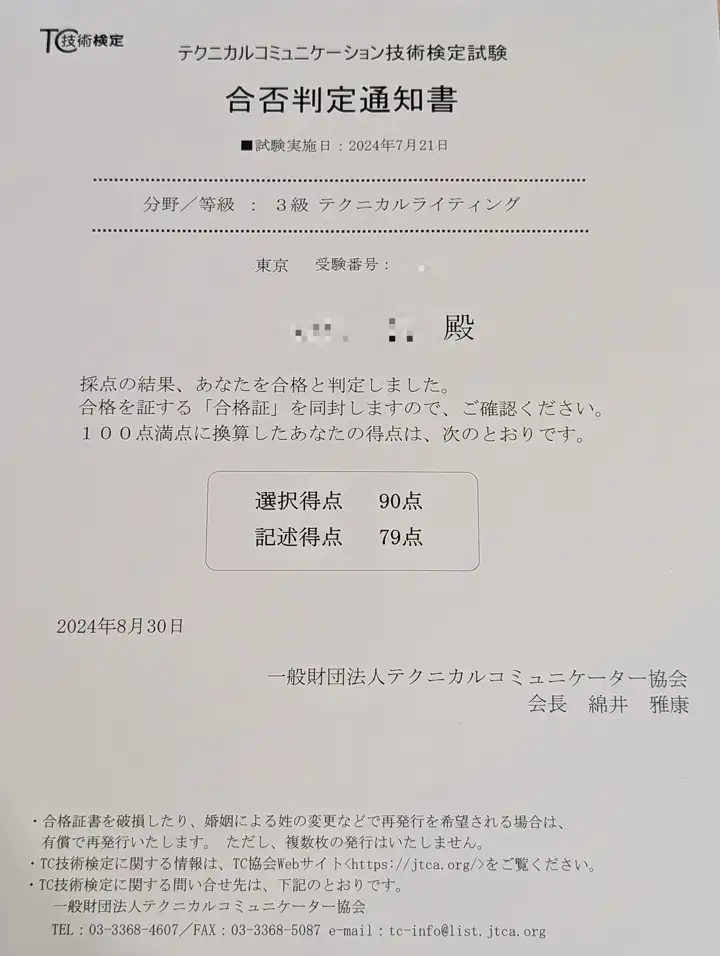

import EmbeddedLink from '@components/mdx/EmbeddedLink.astro'

自分のドキュメントライティングスキルを客観的に評価するために、テクニカルコミュニケーション技術検定試験の「3級テクニカルライティング試験」に挑戦してみました。

## テクニカルコミュニケーション技術検定試験「3級 テクニカルライティング試験」とは

一般財団法人テクニカルコミュニケーター協会（TC協会）によって、テクニカルコミュニケーション技術の到達度を全国規模の統一的な基準で検定し、技術の向上や人材の育成に活用することを目的して実施されている試験です。

<EmbeddedLink url="https://jtca.org/learn-tc/certificate-exam/writing_b/" />

この記事の公開時点では、次の試験が実施されています。

- 3級テクニカルライティング試験[TW]
- 2級使用情報制作ディレクション試験[DR]
- 2級使用情報制作実務試験[MP]

1級については現在は検討中で、まだ実施はされていないようです。詳しい情報は、試験概要にあるので興味があればぜひ！

[テクニカルコミュニケーション技術検定試験 - TC協会（JTCA） 公式サイト](https://jtca.org/learn-tc/certificate-exam/)

## 受験したきっかけ

業務でユーザー向けのドキュメントライティングとレビューに携わる機会が増え、日々「これでユーザーに伝わるのか！？」という気持ちと葛藤しながら文章と向き合っていました。  
またレビューをするときは「なんとなくわかりづらい」といった曖昧なお気持ち表明のようなレビューはしないように心がけてはいるものの、「どうするといい」が明確に伝えきれていない課題を感じていました。

そんなときにたまたまSNSで試験について知り、モヤモヤ解消の一助になるのではないかと考え、受験してみることにしました！

## 試験対策

### 日本語スタイルガイドを読む

試験対策に役立つ書籍は「[日本語スタイルガイド（第3版）](https://amzn.to/3Tda3Dt)」一択になります。

後述するウェビナーで、講師の方が「（おかしい部分もあるが）この書籍に書かれていることが答え」ということを仰っていましたが、とにかくこの書籍がテクニカルライティング試験のバイブルだそうです。

ちなみに、次回以降の試験では新しい版のスタイルガイドから出題される可能性があるため、購入前に最新の情報を確認するようにしましょう。

### 受験対策セミナーを聴講する

書籍以外の学習コンテンツとして受験対策セミナー（ウェビナー）があります。
試験前に[公式サイト](https://jtca.org/)にて開催スケジュールが公開されると思うのでチェックしましょう。

私はウェビナーが視聴できる日の申込期限の翌日に存在に気づき、ダメ元で参加できないか打診したところ快く受け付けていただきました。ありがとうございます 🙏

ウェビナーの内容としては、日本語スタイルガイドをベースに試験に出るポイントを重点的に解説してくれる内容でした。また、模擬問題などのコンテンツの提供もあるので参加をお勧めします。

### 上記以外にやったこと・やっておけばよかったと後悔したこと

試験はすべて記入・記述による解答になります。  
仕事柄、ペンで文字を書くことから遠ざかっていたので、手で文字を書く時間だけは増やしました。特に最近はパソコン・スマートフォンのIMEによる変換に慣れきっていて、漢字が思い出せないということを想定して、日々のタスクなどを紙に書くことを習慣づけました。

ちなみに当日になって後悔したのですが、シャープペンシルに慣れる時間を作り忘れていたのは盲点でした。学生の頃あれほど毎日使っていたツールなのに、当日になって「このシャーペン、芯はどこから補充するんだ！？」となり焦りました。事実です。

## 試験当日

あたり前ですが、受験票は忘れずに持っていきましょう。写真の貼付も必須です！
自分は荷物を軽くしたかったので、試験当日は日本語スタイルガイドを持たずに会場に向かったのですが、持っていくことをお勧めします。試験開始直前まで天井をながめることになり、会場でひとり浮いていました😇

試験は選択問題50分、休憩を挟んで記述問題50分になります。

過去に受験された方の受験記などを見ていても書かれているのですが、とにかく「時間が足りない」と感じました。
1問に詰まってしまうと焦りから芋づる式に詰まるので、わからないと思ったら飛ばして、すぐに解ける問題から解答しました。問題をこなすと視野が広まって、さっきは解答に詰まったのにあとから見るとシュッと解答できたりもするので切り替えが大事ですね。

前半の選択問題は全体を4回くらい見直す時間がありましたが、後半の記述問題は選択問題と違って解答の記入に時間がかかるので、焦らずに1問1問と向き合えるようにすることを心がけるといいと思います。

自分は記入スピードがとにかく遅く、周りから問題用紙をめくる音が聞こえだすと焦ってしまい、記入ミスを連発ました 💦 焦ると書き間違えが増えてより焦るので、日常から文字を書きなれておくことも大事だなと痛感しました。。

## 合否の発表

7月21日に受験をして8月29日に[試験結果のページ](https://jtca.org/learn-tc/certificate-exam/exam_result/)で合格者の受験番号の一覧（速報）が公開され、合格通知の発送が翌日、到着が9月2日だったので1ヶ月ほどかかりました。

ちなみに私の結果ですが…

なんと無事に合格していました！

後半の記述問題についてはまったく手応えがなかったのであきらめていたのですが、わからないと思ったらすぐ飛ばす戦術で最終的には時間に余裕を作ることが出来たので、その戦略が功を奏したのかもしれません。

## さいごに

自分のライティングスキルはまだまだではありますが、受験をきっかけに日々自分が書く文章の癖みたいなものに気づけるようになったなと個人的には感じていて、とてもいい機会になりました。
日常的に文章を書いている方は、受験を考えていなくても「日本語スタイルガイド」に触れることで新たな学びが得られるかもしれません。
