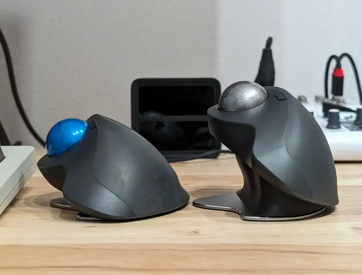

3年ほど使用していたロジクールのMX Ergoのチャタリングが2ヶ月ほど前からひどくなり、日々の作業に支障が出ていたので分解掃除なども定期的に行っていたのですが、持ち手部分もボロボロになってきたことなどもあり、思い切って買い替えしました！（スイッチ交換までは勇気が出ませんでした笑）

  

    <a
      href="https://www.amazon.co.jp/gp/product/B0BXCTQJP7?ie=UTF8&psc=1&linkCode=sl1&tag=tukaelu-22&linkId=594aef2644ae3ad1df2fa7b31d96b5df&language=ja_JP&ref_=as_li_ss_tl"
      data-iframely-url="//cdn.iframe.ly/api/iframe?card=small&url=https%3A%2F%2Fwww.amazon.co.jp%2Fgp%2Fproduct%2FB0BXCTQJP7%3Fie%3DUTF8%26psc%3D1%26linkCode%3Dsl1%26tag%3Dtukaelu-22%26linkId%3D594aef2644ae3ad1df2fa7b31d96b5df%26language%3Dja_JP%26ref_%3Das_li_ss_tl&key=878c5bef402f0b2911bf6d4ce6261abd"
    >
      【Amazon.co.jp限定】 ロジクール ワイヤレス トラックボール MX ERGO MXTB1d
      Bluetooth Unifying 無線 8ボタン 高速充電式 windows mac iPad OS Chrome
      マウス 国内正規品 [ Amazon.co.jp限定 壁紙ダウンロード付き ]
    </a>
  

ちなみにAmazonのタイムセールで15,750円で購入したのですが、3年前に購入した時は11,273円だったのでだいぶ値上がりしましたね…。

MX Ergoは傾斜角を最大20°まで調整できる機構があり、自然に近いポジションでマウス操作ができることで手への負担を軽減できるのですが、それでも若干手に疲れを感じていたので角度調整スタンドも購入してみました！

  

    <a
      href="https://www.amazon.co.jp/gp/product/B0CPWMKPWK?ie=UTF8&th=1&linkCode=sl1&tag=tukaelu-22&linkId=c314a986cf8110d3f7cbadb7db014d99&language=ja_JP&ref_=as_li_ss_tl"
      data-iframely-url="//cdn.iframe.ly/api/iframe?card=small&url=https%3A%2F%2Fwww.amazon.co.jp%2Fgp%2Fproduct%2FB0CPWMKPWK%3Fie%3DUTF8%26th%3D1%26linkCode%3Dsl1%26tag%3Dtukaelu-22%26linkId%3Dc314a986cf8110d3f7cbadb7db014d99%26language%3Dja_JP%26ref_%3Das_li_ss_tl&key=878c5bef402f0b2911bf6d4ce6261abd"
    >
      MX ERGO 角度調整スタンド 傾斜スタンド 傾斜パーツ 角度調整パーツ
      エムエックスエルゴ (40°, ブラック)
    </a>
  

30°、40°、50°、60°の4種類が販売されていたのですが、自分は40°をチョイスしてみました。

標準で傾けられる20°と、40°のスタンドを装着したMX Ergoに違いはこんな感じです。

並べて比較をするとボールの位置がかなり違いますね。
使い始めはボール操作やキーボードからの移動に若干の違和感を感じていたのですが、あっという間に慣れて心なしか手の疲れが軽減した気がします！

これがベストな角度かはまだわからないですが、快適度が違うので気になる方は一度試してみることをおすすめします！
