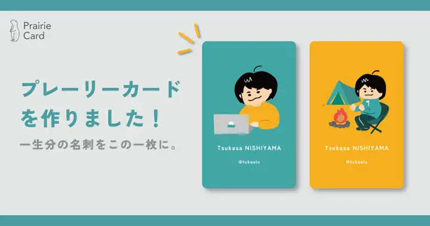
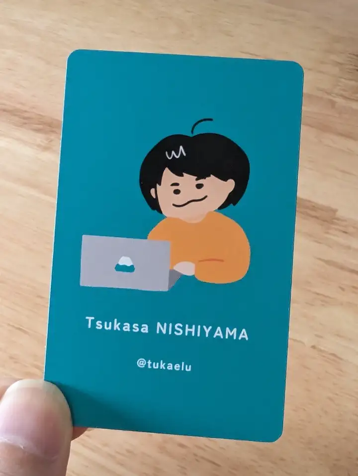
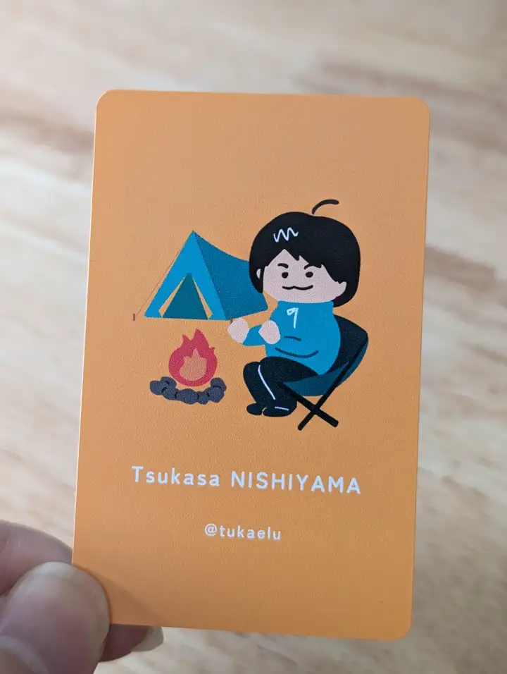

import EmbeddedLink from '@components/mdx/EmbeddedLink.astro'

イベントに参加した際のコミュニケーションのきっかけになればと、ずっと気になっていたプレーリーカードを作りました。

## プレーリーカードとは

<EmbeddedLink url="https://prairie.cards/" />

NFCを読み込めるスマートフォンをカードにかざすと、プロフィールページがブラウザで開くというもの。[^1]

[^1]: 仕組みは違うけど、むかし一部で流行ったPokenを思い出しました。

カードは公式デザインのものに加えて、オリジナルのデザインでも作ることができます。  
自分でデザインする場合も、X(Twitter)をベースにするなどいくつかテンプレートが用意されていました。僕はお絵かきができないので、妻にイメージとカラーコードを伝えて、カード用のイラスト描いてもらいました。

デザイン用のテンプレートにはAdobe Illustrator、Figma、Canvaの3種類が用意されていますが、入稿はPNG画像になるので、実際の出来上がりの色味との差は少し意識する必要がありそうでした。

ちなみに注文時には、以下のようなSNSシェア用の画像がもらえます。自分はシェアするのを完全に忘れていた⋯。

## できあがり

注文してから7営業日ほどで届きました！

   

色味、質感ともに良すぎる⋯！  
入稿用のテンプレートにも注意点として記載があるのですが、実物は入稿データと比較すると少し暗い色味で印刷されるので、そのあたりを意識した配色にすると良さそうです。

イベントなどでかざしてもらうのが楽しみだ！
