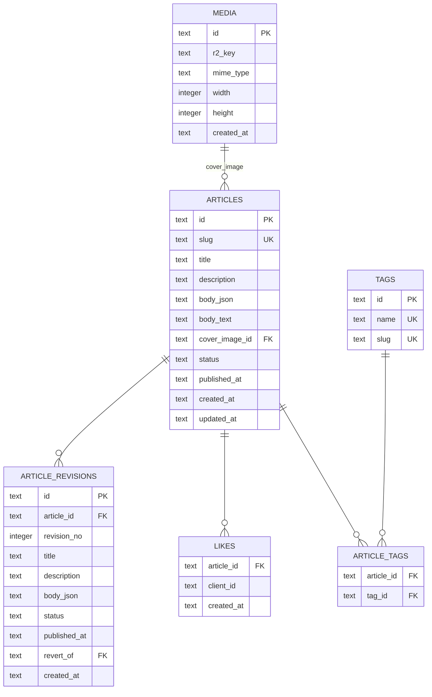

# 個人サイト向け自作CMS アーキテクチャ設計書

最終更新: 2026-08-26
関連ドキュメント: `requirements.md`（要件定義書）

---

## 1. 全体構成

### 1.1 システム構成図（概略）

```
                         ┌─────────────────────────────┐
                         │        Cloudflare CDN        │
                         │  （キャッシュ / 静的アセット） │
                         └───────────────┬───────────────┘
                                         │
                         ┌───────────────▼───────────────┐
                         │      Cloudflare Workers        │
                         │   (Nuxt / Nitro cloudflare)    │
                         │                                 │
                         │  ┌───────────┐  ┌────────────┐ │
                         │  │ 公開ページ │  │  管理画面   │ │
                         │  │(SSR・都度D1│  │ (Nuxt SPA) │ │
                         │  │ 参照+Cache)│  │            │ │
                         │  └───────────┘  └────────────┘ │
                         │  ┌────────────────────────────┐│
                         │  │      API Routes (Nitro)     ││
                         │  │  記事/タグ/いいね/検索/      ││
                         │  │  OGP生成/RSS                ││
                         │  └────────────────────────────┘│
                         └───┬──────────────────┬──────────┘
                             │                  │
                    ┌────────▼───┐       ┌──────▼───────┐
                    │ Cloudflare │       │      R2       │
                    │     D1     │       │ (メディア/OGP │
                    │ (記事/タグ/ │       │  画像キャッシュ)│
                    │  いいね等)  │       │               │
                    └────────────┘       └───────────────┘
```

いいね投稿APIには、Cloudflare Rate Limiting（WAF側のRate Limiting RulesまたはWorkersのRate Limiting Binding）による軽量な濫用対策を適用する。専用の外部サービス（Turnstile等）は導入しない（§8参照）。

### 1.2 レイヤー構成

| レイヤー             | 役割                                                                                                          |
| -------------------- | ------------------------------------------------------------------------------------------------------------- |
| プレゼンテーション層 | Nuxt（Vue）による公開ページ・管理画面のUI                                                                     |
| アプリケーション層   | Nitro（Nuxtのサーバーエンジン）上の API Routes。記事CRUD・検索・OGP生成等                                     |
| データ層             | Cloudflare D1（構造化データ）、Cloudflare R2（メディア/画像）                                                 |
| 横断的関心事         | 認証（管理画面、Cloudflare Access）、いいねAPIの濫用対策（Rate Limiting）、キャッシュ（Cloudflare Cache API） |

### 1.3 レンダリング戦略（確定）

公開ページは**アクセスの都度D1を参照して動的にレンダリングする方式（SSR）を採用する**。記事投稿・公開のタイミングで静的HTMLを事前生成する方式（SSG）は採らない。

| 検討軸         | 動的（SSR、採用）                                                                                                                     | 静的生成（SSG）                                                                                                                                                                        |
| -------------- | ------------------------------------------------------------------------------------------------------------------------------------- | -------------------------------------------------------------------------------------------------------------------------------------------------------------------------------------- |
| いいね数の表示 | クエリ結果をそのまま反映できる                                                                                                        | 静的ページに焼き込む場合、更新の度に該当ページの再生成が必要                                                                                                                           |
| 検索機能       | D1へのライブクエリが前提のため相性が良い                                                                                              | 検索結果ページ自体は静的化できない                                                                                                                                                     |
| 予約投稿       | クエリに `published_at <= now()` を加えるだけで実現できる                                                                             | 「公開ボタンを押した瞬間」にビルドが走るモデルのため、未来の公開日時を自動的に反映する仕組みがない。Cloudflare Cron Triggersで定期的に該当記事の再ビルドをキックする別実装が必要になる |
| パフォーマンス | Cloudflareの Cache API でレスポンスをエッジキャッシュし、記事の公開・更新時にキャッシュをパージすることで静的に近い体感速度を担保する | ビルド済みなので高速だが、即時反映されない（再デプロイのタイムラグが生じる）                                                                                                           |

`nuxt generate` によるプリレンダリングという選択肢もあるが、CMSとしての即時性（公開してすぐ反映される）といいねの動的性を優先し、本プロジェクトでは採用しない。予約投稿は本項の方式により**対応する**（要件定義書 §9 で決定済み）。

### 1.4 ディレクトリ構成（確定）

Nuxt 4の標準構成（`srcDir`が`app/`配下になる構成）をベースとする。`app/`・`server/`・`shared/`はいずれもNuxt 4/Nitroのフレームワーク自体が定める標準ディレクトリであり、特定のリポジトリを参考にした結果ではない。マイグレーションの配置（`migrations/`）もWranglerの既定パスをそのまま採用しており、独自の階層は設けていない。`scripts/`配下の移行スクリプトのみ、本プロジェクト固有の要件（既存Astroサイトからの移行、`spec-migration.md`）に基づく追加である。

```
.
├── .github/
│   └── workflows/                 # Lint・型チェック・ユニット/E2Eテスト等のCI（§11.4参照）
├── app/                           # Nuxt 4 アプリケーション本体
│   ├── assets/                    # ビルド時に処理されるCSS等
│   ├── components/
│   │   ├── editor/                # Tiptapエディタ本体・ツールバー
│   │   │   └── nodes/             # 独自ノードのNodeView（LinkCard/CodeBlock/Embed/Mermaid/Footnote）
│   │   ├── admin/                 # 管理画面専用コンポーネント（記事一覧、リビジョンパネル、AI支援パネル等）
│   │   └── site/                  # 公開ページ専用コンポーネント（記事カード、目次、ページネーション等）
│   ├── composables/                # useAutosave, useAiAssist, useLike 等
│   ├── layouts/
│   │   ├── default.vue             # 公開サイト用レイアウト
│   │   └── admin.vue               # 管理画面用レイアウト
│   ├── middleware/                 # ルートミドルウェア（ローカルでのAccessバイパス、spec-ops.md §3.4）
│   ├── pages/
│   │   ├── index.vue               # トップページ
│   │   ├── page/[n].vue
│   │   ├── posts/[slug].vue        # 記事詳細
│   │   ├── tags/[slug].vue         # タグ別一覧
│   │   ├── search.vue
│   │   └── admin/
│   │       ├── index.vue           # 記事一覧（spec-article-editing.md §3.1）
│   │       ├── articles/
│   │       │   ├── new.vue
│   │       │   └── [id]/
│   │       │       ├── index.vue       # 記事編集画面（§3.2）
│   │       │       └── revisions.vue   # リビジョン一覧・差分（§3.3-3.4）
│   │       └── media.vue           # メディアライブラリ（spec-media.md §3.1）
│   ├── app.vue
│   └── error.vue                   # 404等（spec-public-site.md §3.5）
├── server/                         # Nitro API Routes
│   ├── api/
│   │   ├── articles/
│   │   │   ├── index.get.ts        # 記事一覧
│   │   │   └── [slug].get.ts       # 記事詳細
│   │   ├── tags/[slug]/articles.get.ts
│   │   ├── search.get.ts
│   │   ├── articles/[id]/like.post.ts
│   │   ├── rss.xml.get.ts
│   │   ├── sitemap.xml.get.ts
│   │   ├── og/[slug].get.ts        # OGP画像生成（takumi-rs、architecture.md §10）
│   │   ├── media/[key].get.ts      # 画像配信（spec-media.md §4.4）
│   │   └── admin/
│   │       ├── articles/
│   │       │   ├── index.get.ts
│   │       │   ├── index.post.ts
│   │       │   └── [id]/
│   │       │       ├── index.put.ts
│   │       │       ├── index.delete.ts
│   │       │       └── revisions/
│   │       │           ├── index.get.ts
│   │       │           └── [revisionId]/
│   │       │               ├── index.get.ts
│   │       │               ├── diff.get.ts
│   │       │               └── revert.post.ts
│   │       ├── media/
│   │       │   ├── index.get.ts
│   │       │   ├── index.post.ts
│   │       │   └── [id].delete.ts
│   │       └── ai/                 # spec-ai-assist.md §4
│   │           ├── proofread.post.ts
│   │           ├── summarize.post.ts
│   │           ├── outline.post.ts
│   │           ├── suggest-title.post.ts
│   │           └── suggest-slug.post.ts
│   ├── middleware/                 # サーバー側ミドルウェア（認証チェック等）
│   └── utils/                      # D1クエリヘルパー、AI Gatewayクライアント、TOC/読了時間算出、OTEL計装設定（`instrument()`、spec-ops.md §8）等
├── shared/                         # クライアント・サーバー共通の型定義
│   ├── types/
│   │   ├── article.ts
│   │   ├── tiptap-nodes.ts         # 独自ノードのZodスキーマ（architecture.md §4.2）
│   │   └── ai.ts
│   └── utils/
├── docs/                            # 要件定義・アーキテクチャ設計・機能仕様書
│   ├── requirements.md
│   ├── architecture.md
│   └── specs/
│       ├── article-editing.md        # 記事編集・エディタ・リビジョン管理
│       ├── ai-assist.md              # AI執筆支援
│       ├── media.md                  # メディア管理
│       ├── public-site.md            # 公開サイト
│       ├── migration.md              # 既存記事の移行
│       ├── ops.md                    # 認証・バックアップ・開発環境
│       └── testing.md                # テスト戦略（ユニット・E2E）
├── migrations/                     # D1 SQLマイグレーション（Wranglerの既定パス。architecture.md §3.2）
├── public/                         # favicon等の静的アセット
├── scripts/
│   ├── migrate-from-astro/         # 既存記事移行スクリプト（spec-migration.md、一度きり実行のCLI）
│   │   ├── index.ts
│   │   ├── frontmatter.ts
│   │   ├── markdown-to-tiptap.ts
│   │   └── report.ts               # dry-runレポート出力（spec-migration.md §5）
│   └── seed-test-data.ts           # E2E用フィクスチャ投入スクリプト（spec-testing.md §5.4）
├── tests/
│   └── e2e/                        # Playwright E2Eテスト（spec-testing.md §5）
│       ├── article-editing.spec.ts
│       ├── public-site.spec.ts
│       ├── ai-assist.spec.ts
│       └── fixtures/
│           └── ai-mock-responses.ts # AI執筆支援のモックレスポンス（spec-testing.md §5.3）
├── .dev.vars.example                # ローカル用シークレットのテンプレート（spec-ops.md §5.2）
├── .env.example
├── nuxt.config.ts
├── playwright.config.ts             # E2Eテスト設定（spec-testing.md §3）
├── vitest.config.ts                 # ユニットテスト設定（spec-testing.md §3）
├── wrangler.jsonc                   # production / env.preview のバインディング定義（architecture.md §11.1）
├── package.json
└── tsconfig.json
```

**ユニットテストの配置について**：`server/utils/toc.ts`のようなロジックファイルには、同ディレクトリに`toc.test.ts`のように**コロケーション（隣接配置）**する（Vitestの一般的な慣習）。上記ツリーでは省略しているが、`spec-testing.md` §4.1 の対象表に配置場所を記載している。

**既存サイト（`tukaelu/blog`）との対比**：既存はAstroの`contents/posts`にMarkdownファイルを直接置く構成だったが、新構成ではコンテンツそのものはD1（+ R2）に移り、`contents/`ディレクトリ自体は移行完了後に不要になる（移行スクリプト実行中のみ、入力ソースとして参照する）。`app/`と`server/`が管理画面・公開ページ・APIをまとめて抱える一体型の構成になる点が、静的サイトジェネレータからの最も大きな構造変化と言える。

---

## 2. 技術スタック

| 領域                        | 採用技術                                                         | 備考                                                                |
| --------------------------- | ---------------------------------------------------------------- | ------------------------------------------------------------------- |
| フロントエンド/フルスタック | Nuxt (Vue 3)                                                     | 要件定義書の決定事項                                                |
| 実行基盤                    | Cloudflare Workers（Nitro `cloudflare` preset、Workers Assets）  | 公式フレームワークガイドに準拠                                      |
| エディタ                    | Tiptap                                                           | ProseMirrorベース。JSON文書モデルをそのまま永続化                   |
| データベース                | Cloudflare D1（SQLite）                                          | 記事・タグ・いいね等のメタデータ                                    |
| ストレージ                  | Cloudflare R2                                                    | 画像等のメディア、OGP画像キャッシュ                                 |
| 全文検索                    | D1 + SQLite FTS5仮想テーブル                                     | D1はFTS5モジュールをサポート                                        |
| いいねAPIの濫用対策         | Cloudflare Rate Limiting                                         | Turnstileは不採用（§8参照）                                         |
| OGP画像生成                 | takumi-rs（`@takumi-rs/wasm`）                                   | Rust製、JSXから直接ラスタライズ。satori比で2〜10倍高速。§10 参照    |
| AI執筆支援                  | OpenAI(gpt-4o-mini想定) + Cloudflare AI Gateway                  | 校正・要約・アウトライン提案・タイトル提案・スラッグ提案。§6.3 参照 |
| 管理画面認証                | Cloudflare Access                                                | §7 参照                                                             |
| CI/CD                       | GitHub Actions + Wrangler（または NuxtHub のWorkers Builds連携） | §11 参照                                                            |
| バリデーション              | Zod                                                              | API入出力・ノードスキーマの検証                                     |
| ORM                         | Drizzle ORM                                                      | D1との相性が良く型安全なクエリが書ける。生SQLは書かない方針（§3.2） |
| ユニットテスト              | Vitest（+ `@nuxt/test-utils`）                                   | Nuxt公式推奨。§spec-testing.md 参照                                 |
| E2Eテスト                   | Playwright                                                       | ローカル（CI内`wrangler dev`）に対して実行。§spec-testing.md 参照   |
| 監視・可観測性              | OpenTelemetry（`@microlabs/otel-cf-workers`） + Mackerel         | OTLP/HTTPでエクスポート。`spec-ops.md` §8 参照                      |

---

## 3. データモデル設計

### 3.1 ER概要



### 3.2 D1スキーマ（例）

スキーマの実体は`server/database/schema.ts`（Drizzle ORMの`sqliteTable`定義）が正となる。以下はその内容と等価なSQLでの参考表示。`articles_fts`（FTS5仮想テーブル）のみDrizzleのスキーマビルダーで表現できないため`migrations/0001_fts5_articles_search.sql`で手書き管理する（§3.2末尾・§9参照）。

```sql
-- 記事
CREATE TABLE articles (
  id            TEXT PRIMARY KEY,          -- ULID等
  slug          TEXT UNIQUE NOT NULL,
  title         TEXT NOT NULL,
  description   TEXT,
  body_json     TEXT NOT NULL,             -- Tiptap JSON文書を文字列化して保存
  body_text     TEXT NOT NULL,             -- 検索用に抽出したプレーンテキスト（FTS5の索引対象）
  cover_image_id TEXT REFERENCES media(id),
  status        TEXT NOT NULL DEFAULT 'draft', -- draft | published
  published_at  TEXT,                      -- ISO8601。未来の日時であれば「予約中」として扱う（§1.3）
  created_at    TEXT NOT NULL,
  updated_at    TEXT NOT NULL
);

-- タグ
CREATE TABLE tags (
  id   TEXT PRIMARY KEY,
  name TEXT UNIQUE NOT NULL,
  slug TEXT UNIQUE NOT NULL
);

-- 記事とタグの中間テーブル
CREATE TABLE article_tags (
  article_id TEXT NOT NULL REFERENCES articles(id) ON DELETE CASCADE,
  tag_id     TEXT NOT NULL REFERENCES tags(id) ON DELETE CASCADE,
  PRIMARY KEY (article_id, tag_id)
);

-- メディア（R2オブジェクトのメタデータ）
CREATE TABLE media (
  id         TEXT PRIMARY KEY,
  r2_key     TEXT NOT NULL,
  mime_type  TEXT NOT NULL,
  width      INTEGER,
  height     INTEGER,
  created_at TEXT NOT NULL
);

-- いいね（重複防止のためクライアント識別子でユニーク制約を掛ける想定）
CREATE TABLE likes (
  article_id TEXT NOT NULL REFERENCES articles(id) ON DELETE CASCADE,
  client_id  TEXT NOT NULL,  -- Cookie等で生成した匿名クライアントID
  created_at TEXT NOT NULL,
  PRIMARY KEY (article_id, client_id)
);

-- リビジョン（記事の明示的保存時点のスナップショット）
CREATE TABLE article_revisions (
  id            TEXT PRIMARY KEY,          -- ULID等
  article_id    TEXT NOT NULL REFERENCES articles(id) ON DELETE CASCADE,
  revision_no   INTEGER NOT NULL,          -- 記事ごとに1から連番
  title         TEXT NOT NULL,
  description   TEXT,
  body_json     TEXT NOT NULL,
  status        TEXT NOT NULL,             -- 保存時点のステータス（draft | published）
  published_at  TEXT,
  revert_of     TEXT REFERENCES article_revisions(id), -- 復元操作で作られた場合、復元元リビジョンを指す
  created_at    TEXT NOT NULL,
  UNIQUE (article_id, revision_no)
);

-- 全文検索用の仮想テーブル（FTS5）
-- 独立したFTS5テーブルとし、articlesとの同期はアプリケーション側（記事保存/削除API）で明示的に行う
-- （外部コンテンツテーブル方式は元テーブル更新時の同期にトリガーが必須になるため採らない）。
CREATE VIRTUAL TABLE articles_fts USING fts5(
  article_id UNINDEXED,
  title,
  body_text,
  tokenize='unicode61'  -- 日本語対応は §9 参照
);
```

D1はFTS5モジュールを含むSQLite拡張のサブセットをサポートしており、`CREATE VIRTUAL TABLE ... USING fts5(...)` がそのまま利用できる。ただし FTS5 を含むデータベースは `wrangler d1 export` でのエクスポートに制限があり、エクスポート時は仮想テーブルの削除・再作成が必要になる点に留意する。

マイグレーションは`drizzle-kit generate`で`server/database/schema.ts`から自動生成する（6テーブル分、`migrations/0000_initial_schema.sql`）。`articles_fts`のみ`drizzle-kit generate --custom`で生成した空ファイルに上記のSQLを手書きする（`migrations/0001_fts5_articles_search.sql`）。生成後は他のマイグレーションと同様`wrangler d1 migrations apply`で適用する。スキーマ変更時は`pnpm db:generate`を実行する。

`article_revisions.revision_no` は記事ごとに1から始まる連番とし、リビジョン作成時にDrizzleの`max()`集約関数で`SELECT MAX(revision_no) FROM article_revisions WHERE article_id = ?`相当のクエリを実行し、`(結果 ?? 0) + 1`で採番してからINSERTする。単一運営者の運用であり同時書き込みの競合はほぼ想定されないため、この程度のシンプルな採番で十分とする。

**DBアクセス方針（確定）**: すべてのD1操作はDrizzle ORM（`server/utils/db.ts`の`useDrizzle(event)`）経由のクエリビルダー、または`articles`⇄`tags`のような多対多関係はDrizzleのrelational query API（`db.query.articles.findMany({ with: {...} })`）で行い、生SQLの手書きを避ける。唯一の例外はFTS5の`MATCH`/`bm25()`/`snippet()`で、これらは仮想テーブル・ランキング関数のためどのORMでも抽象化できず、Drizzleの`sql`テンプレートタグ（`db.all(sql\`...\`)`、パラメータは自動バインド）を使う（`server/utils/search-index.ts`, `server/api/search.get.ts`のみ）。

**`published_at` の日時比較に関する注意点（フェーズ2実装時に発見・修正した重大バグ、2026-08-26）**

公開判定クエリ（`status = 'published' AND published_at <= now()`相当）で、アプリ側が保存する`published_at`はJavaScript `Date.toISOString()`形式（`T`区切り・ミリ秒・`Z`サフィックス、例: `2026-08-25T21:17:39.222Z`）だが、SQLiteの`datetime('now')`はスペース区切り形式（例: `2026-08-25 21:17:39`）を返す。この2つを単純な文字列比較（`published_at <= datetime('now')`）で比較すると、同日中は`"T"`(0x54) > `" "`(0x20)の文字コード差により**常にfalseと判定される**（日付が異なる記事では表面化しないため見落としやすい）。

対策として、比較対象の両辺を`datetime()`関数で正規化してから比較すること：`datetime(published_at) <= datetime('now')`。公開ページの記事一覧・詳細APIの実装で必ずこの形式を使う。

### 3.3 記事本文（Tiptap JSON）の格納方式

- `articles.body_json` に Tiptap のドキュメントJSON（ProseMirrorのdoc構造）をそのまま文字列化して保存する。D1はJSON拡張関数（`json_extract`等）もサポートしているため、将来的に特定ノードの有無で絞り込むといったクエリも可能。
- 検索用に、保存時（記事保存API内）でJSONツリーを走査してプレーンテキストを抽出し `body_text` に非正規化して保持する。これをFTS5の索引対象とする。
- レンダリング時は `body_json` をパースし、ノードタイプごとにVueコンポーネントへマッピングする（§4）。

### 3.4 既存記事（Markdown/MDX）の移行

現行サイト（`tukaelu/blog`）は `contents/posts` 配下にフロントマター付きMarkdown/MDXで記事を保持している。移行スクリプトでは以下を行う。

1. `gray-matter` 等でフロントマター（タイトル・タグ・公開日等）とMarkdown本文を分離
2. Markdown本文をASTへパースし（`remark`等）、Tiptapのノード構造（`paragraph`/`heading`/`codeBlock`等）へ変換
3. フロントマターのメタデータを `articles` テーブルへ、変換後の構造化データを `body_json` へ格納
4. 画像はR2へアップロードし、`media` テーブルにメタデータを記録、本文中の参照パスを新しい配信URLへ置き換える

MDX特有の構文（コンポーネント埋め込み等）を使っている箇所は自動変換が難しいため、移行スクリプトで検出してリストアップし、手動での見直しを行う運用とする。

---

## 4. レンダリングパイプライン

### 4.1 Tiptap JSON → Vueコンポーネントツリー

記事保存時のデータ構造（Tiptap/ProseMirrorのJSON）を、公開ページのレンダリング時に再帰的にVueコンポーネントへマッピングする。HTMLやMarkdownを中間表現として経由しないため、パース処理・DOM操作が不要になる。

```
NodeRenderer(node)
 ├─ node.type === 'paragraph'  → <p>
 ├─ node.type === 'heading'    → <h2>〜<h4>
 ├─ node.type === 'codeBlock'  → <CodeBlock :lang :filepath>（Shiki等でハイライト）
 ├─ node.type === 'linkCard'   → <LinkCard :url>（OGP情報を取得してカード表示）
 ├─ node.type === 'embed'      → <EmbedGitHub|EmbedYouTube|EmbedX>
 ├─ node.type === 'mermaid'    → <MermaidDiagram :source>
 ├─ node.type === 'image'      → <ArticleImage>（R2配信URLへ解決）
 └─ その他 → フォールバック（プレーンテキスト表示）
```

### 4.2 独自ノードの一覧（初期セット）

| ノードタイプ | 概要                                                                                       |
| ------------ | ------------------------------------------------------------------------------------------ |
| `linkCard`   | URL単体行を、OGP情報付きのリッチカードに変換                                               |
| `codeBlock`  | 言語・ファイルパス付きのコードブロック。シンタックスハイライト                             |
| `embed`      | GitHub / YouTube / X / Instagram の埋め込み                                                |
| `mermaid`    | Mermaid記法による図表描画                                                                  |
| `footnote`   | 脚注。参照元にアンカー番号を表示し、本文末尾に脚注一覧を集約する（既存サイトの記法を踏襲） |

新しいノードを追加する際は、①Tiptapの拡張（Node Extension）を実装、②Zodスキーマに型を追加、③レンダラー側にコンポーネントを追加、の3点をセットで行う運用とする。

**実装時に確定した詳細（2026-08-26、フェーズ4実装時）**

- `embed`のprovider判定：URLからの自動判定は行わず、ツールバー側でボタンごとにprovider（github/youtube/x/instagram）を固定して挿入する
- `embed`の表示方式：YouTubeは`<iframe>`埋め込み（SSR可能）。X/Instagramは公式ウィジェットスクリプト（`platform.twitter.com/widgets.js` / `www.instagram.com/embed.js`）がDOM操作するためクライアント専用（`<ClientOnly>`）。GitHubは`linkCard`と同じOGPカード表示で代用する（gistのscript埋め込み等は行わない）
- `codeBlock`のシンタックスハイライト：Shikiを採用（既存Astroサイトと同一）。**ただしShikiの標準インポート（全言語バンドル）はサーバーバンドルが11.5MBに達しCloudflare Workersのスクリプトサイズ上限を超えるため、`@shikijs/langs-precompiled` + `createJavaScriptRawEngine`によるfine-grained bundleを採用し、対応言語をjavascript/typescript/shellscript(`sh`)/html/css/json/yaml/python/goの9言語に限定した（バンドルサイズ 1.84MB / gzip 459KBまで削減）**。oniguruma(WASM)エンジンはCloudflare Workers上でのロードが煩雑なため使用しない。エディタ内でのリアルタイムハイライトは行わず、公開ページのレンダリング時のみハイライトする
- `mermaid`の描画：`mermaid`パッケージをクライアントサイドのみで動的import・レンダリングする（`<ClientOnly>`、SSR/JS無効時はソースをそのままテキスト表示）
- `footnote`の実装：脚注定義をノード自身の`attrs.content`に持たせるインライン方式とし、Markdown記法のような「本文と離れた場所に定義を書く」構成は採らない。番号は記事取得時にサーバー側で文書を走査し出現順に採番する（DBには保存しない）

### 4.3 公開ページの構成（確定）

既存サイト（[nsymtks.com](https://nsymtks.com)）の実際の画面を確認した上で、基本構成を踏襲する。

**画面一覧**

| 画面                     | パス                  | データソース                                       |
| ------------------------ | --------------------- | -------------------------------------------------- |
| トップページ（記事一覧） | `/`、`/page/:n`       | `GET /api/articles`（ページネーション付き）        |
| 記事詳細                 | `/posts/:slug`        | `GET /api/articles/:slug`                          |
| タグ別一覧               | `/tags/:slug`（想定） | `GET /api/tags/:slug/articles`（新規追加、§5参照） |
| 検索結果                 | `/search`             | `GET /api/search?q=`                               |
| RSSフィード              | `/rss.xml`            | `GET /api/rss.xml`                                 |
| サイトマップ             | `/sitemap.xml`        | 動的生成（公開記事一覧＋タグ一覧から）             |
| OGP画像                  | `/api/og/:slug`       | `GET /api/og/:slug`（§10参照）                     |
| 404ページ                | 任意の未定義パス      | Nuxtの標準エラーページ機構                         |

**目次（TOC）の生成**

記事本文（Tiptap JSON）を走査し、`heading`ノードの一覧からアンカーリンク付きの目次を生成する。既存サイトと同様、本文冒頭と末尾の両方に目次を表示する。レンダリング時に都度生成するため、DBへ目次データを別途保存する必要はない。

**読了時間の表示**

記事の本文文字数（`body_text`）から概算の読了時間を算出し、トップページの一覧・記事詳細ページの双方に表示する。日本語の平均読書速度（目安：400〜600字/分程度）を係数として概算する。

**脚注**

Tiptapの`footnote`ノード（§4.2）で表現し、参照元にアンカー番号、本文末尾に脚注一覧を表示する。

**タグ別一覧・検索UIについて（確定：新規追加、2026-08-26ソース確認）**

現行サイト（`tukaelu/blog`）のソース（`src/pages`, `src/components/post/PostCard.astro`, `PostHeader.astro`）を直接確認した結果、**タグ別一覧ページ・検索ページのいずれも現行サイトには存在しない**ことが判明した。

- タグは`PostCard.astro`/`PostHeader.astro`いずれも`<span>`要素でレンダリングされており、クリック不可（リンクではない）
- `src/pages`配下に`tags`・`search`に該当するページは存在しない

要件定義書 §5.3・§5.8で両機能は「実装する」と決定済みのため実装自体に変更はないが、「既存サイトの構成を踏襲する」ものではなく、**新規に追加する画面・UI**として設計する（既存の見た目・導線に合わせる制約がないため、UI配置は本プロジェクトで自由に決定してよい）。具体的な画面配置は`spec-public-site.md`側で定める。

**OGP画像URLについて（確定）**

既存サイトは `/ogp/{slug}.png` というビルド時生成の静的パスだが、新CMSでは `/api/og/:slug` という動的生成のパスをそのまま採用する（既存パスへの追従・リダイレクト対応は行わない）。

過去にSNS等でシェアされたリンクのOGPプレビュー画像は、シェア時点でプラットフォーム側にキャッシュされていることが多く、移行後に遡って崩れる実害は小さいと判断する。移行後に新規シェアされるリンクは、新しいパスのOGP画像が正しく参照される。

---

## 5. API設計（例）

| メソッド            | パス                                                          | 用途                                                                                | 認証                      |
| ------------------- | ------------------------------------------------------------- | ----------------------------------------------------------------------------------- | ------------------------- |
| GET                 | `/api/articles`                                               | 公開記事一覧（ページネーション）                                                    | 不要                      |
| GET                 | `/api/articles/:slug`                                         | 記事詳細                                                                            | 不要                      |
| GET                 | `/api/tags/:slug/articles`                                    | タグ別記事一覧（ページネーション付き）                                              | 不要                      |
| GET                 | `/api/search?q=`                                              | 全文検索                                                                            | 不要                      |
| POST                | `/api/articles/:id/like`                                      | いいね登録                                                                          | 不要（Rate Limiting適用） |
| GET                 | `/api/rss.xml`                                                | RSSフィード                                                                         | 不要                      |
| GET                 | `/media/:key`                                                 | 画像配信（`/cdn-cgi/image/<options>/`と組み合わせてオンザフライ変換）               | 不要                      |
| GET                 | `/api/og/:slug`                                               | OGP画像生成                                                                         | 不要（キャッシュ利用）    |
| GET/POST/PUT/DELETE | `/api/admin/articles/*`                                       | 記事管理CRUD                                                                        | **必須**（管理者認証）    |
| GET/POST/DELETE     | `/api/admin/media/*`                                          | メディア管理                                                                        | **必須**                  |
| PUT                 | `/api/admin/articles/:id`                                     | 記事の明示的保存（下書き保存/公開）。保存の都度リビジョンを作成する                 | **必須**                  |
| GET                 | `/api/admin/articles/:id/revisions`                           | リビジョン一覧取得                                                                  | **必須**                  |
| GET                 | `/api/admin/articles/:id/revisions/:revisionId`               | 特定リビジョンのスナップショット取得                                                | **必須**                  |
| GET                 | `/api/admin/articles/:id/revisions/:revisionId/diff?against=` | 指定リビジョンと直前リビジョン（または `against=current` で現在の内容）との差分取得 | **必須**                  |
| POST                | `/api/admin/articles/:id/revisions/:revisionId/revert`        | 指定リビジョンの内容を現在の記事へ反映し、新しいリビジョンとして記録する            | **必須**                  |
| POST                | `/api/admin/ai/proofread`                                     | 校正（誤字脱字・文法チェック）                                                      | **必須**                  |
| POST                | `/api/admin/ai/summarize`                                     | 概要文（description）の自動生成                                                     | **必須**                  |
| POST                | `/api/admin/ai/outline`                                       | 構成・アウトライン提案                                                              | **必須**                  |
| POST                | `/api/admin/ai/suggest-title`                                 | タイトル提案                                                                        | **必須**                  |
| POST                | `/api/admin/ai/suggest-slug`                                  | スラッグ提案                                                                        | **必須**                  |

`/api/admin/*` 以下は認証必須のルートとして明確に分離し、ミドルウェアレベルでガードする。

---

## 6. 管理画面（エディタ）設計

### 6.1 記事編集・一覧

- 記事一覧画面：ステータス(下書き/予約中/公開済み)、更新日時でのソート・フィルタ。予約中は `status = 'published'` かつ `published_at` が未来の記事として計算表示する
- 記事編集画面：Tiptapエディタを中心に据え、タイトル・スラッグ・タグ・アイキャッチ・公開日時以外の情報は極力視界に入れないミニマルなレイアウトとする(参考：しずかなインターネットのエディタ体験)
- モバイル向けに、ソフトブレイク(段落を変えない改行)を明示的に入力できる専用ツールバーボタンを用意する
- 自動保存(一定間隔、またはblur時にサーバーへは送信せず、ブラウザの`localStorage`へドラフト保存する。ブラウザを誤って閉じた場合の復元用途に限定し、サーバー側の記事データ・リビジョンには一切影響しない。詳細は spec-article-editing.md §6.2)

### 6.2 リビジョン管理（確定）

**保存とリビジョン作成のタイミング**

編集画面の「保存」「公開」操作(＝明示的保存)のたびに `PUT /api/admin/articles/:id`（新規記事なら`POST /api/admin/articles`）を呼び出し、現在の `articles` レコードを更新すると同時に `article_revisions` へスナップショット(タイトル・概要・`body_json`・ステータス・公開日時)を1件追加する。下書き状態での保存も対象に含める(要件定義書 §5.2)。自動保存はサーバーへ送信しない(`localStorage`のみ)ため、記事データ・リビジョンのいずれにも影響しない。

**差分表示の方式**

`body_json`（Tiptap JSON）同士をそのまま構造比較すると、細かいノード属性の変化まで拾ってしまい人間が読める差分にならない。そのため、以下の方式を採用する。

1. 各リビジョンの `body_json` から、段落・見出し単位で改行を保持したプレーンテキストを抽出する(FTS5索引用の `body_text` 抽出とは目的が異なるため、抽出ロジックは共有せず別関数として持つ)
2. 抽出したテキストに対し、`diff` パッケージ(Myersアルゴリズム)等の行/単語単位のテキスト差分ライブラリで比較する
3. タイトル・概要はそのまま文字列としてテキスト差分を取る
4. 画像やリンクカードの追加・削除等、ノード単位の構造的差分(「この位置に画像が追加された」等)の可視化は本バージョンのスコープ外とし、将来の拡張候補とする

**復元の方式**

リビジョン一覧から任意のリビジョンを選び「このバージョンに戻す」を実行すると、`POST /api/admin/articles/:id/revisions/:revisionId/revert` が呼ばれ、以下を行う。

1. 復元元リビジョンのスナップショット(タイトル・概要・`body_json`・ステータス・公開日時)を、現在の `articles` レコードへコピーする
2. その状態を新しいリビジョンとして `article_revisions` へ追加する。`revert_of` カラムに復元元リビジョンのIDを記録し、「これはリビジョンNからの復元である」という来歴を残す

過去のリビジョンは一切上書き・削除されないため、復元操作自体もあとから履歴として追跡できる(Gitの`revert`と同じ非破壊モデル)。

**ストレージ規模の見積り**

個人ブログ規模では、1記事あたりのリビジョン数・本文サイズを考慮してもD1のストレージ無料枠(5GB)に対して十分小さく、リビジョンの世代整理(古いリビジョンの自動削除等)は現時点では不要と判断する。将来的にリビジョン数が肥大化した場合の対応は §15 のオープンな論点として記録する。

### 6.3 AI執筆支援（確定）

**AI基盤の選定**

モデルは **OpenAI（gpt-4o-mini想定）** を採用する。Workers AIのオープンソースモデルは日本語タスクでの精度が読みにくく、校正のような繊細なタスクでは実績のある外部モデルを優先する（要件定義書の壁打ちで確認済み）。

ただし、OpenAIへは直接アクセスせず、**Cloudflare AI Gatewayを経由して呼び出す**。理由は以下の通り。

- キャッシュ・レート制限・ログ/分析といったコア機能が全プランで無料
- モデル自体は外部でも、リクエストの経路・可観測性・コスト管理はCloudflareダッシュボードに一元化できる（「Cloudflareスタックで完結させたい」という当初の方針からの逸脱を最小限に抑えられる）
- APIキーはAI GatewayのBYOK（Bring Your Own Key）機能でCloudflare側に登録することができ、Workerのコード・環境変数に生のAPIキーを持たせずに済む構成も選べる
- 将来的にモデルを差し替えたくなった場合も、AI Gatewayが単一のインターフェース（OpenAI SDK互換のエンドポイント）を提供するため切り替えコストが低い

**各機能の実装方式**

| 機能                   | エンドポイント                     | 実装方針                                                                                                                                                                                                                                                               |
| ---------------------- | ---------------------------------- | ---------------------------------------------------------------------------------------------------------------------------------------------------------------------------------------------------------------------------------------------------------------------- |
| 校正                   | `POST /api/admin/ai/proofread`     | 本文のプレーンテキスト抽出を送信し、構造化出力（JSON配列：該当箇所の引用・修正案・理由）で受け取る。エディタ横のサイドパネルに一覧表示し、項目ごとに「適用」ボタンで該当テキストを検索・置換する。MVPでは文字単位のインラインハイライトは行わない（将来拡張、§15参照） |
| 概要文自動生成         | `POST /api/admin/ai/summarize`     | 本文全体を送信し、100〜120字程度の要約を生成。結果はdescriptionフィールドに反映し、保存前に手動編集可能とする                                                                                                                                                          |
| 構成・アウトライン提案 | `POST /api/admin/ai/outline`       | タイトルと簡単なメモを送信し、見出し（`heading`ノード）構成の案をリストで受け取る。提案をワンクリックでエディタへスケルトンとして挿入する。既存下書きの再構成提案は将来拡張とし、MVPでは新規執筆時のアウトライン生成に絞る                                             |
| タイトル提案           | `POST /api/admin/ai/suggest-title` | 本文（執筆前であれば代わりにメモ）を送信し、候補タイトルを3〜5件程度リストで受け取る。一覧から選択してタイトルフィールドへ適用する                                                                                                                                     |
| スラッグ提案           | `POST /api/admin/ai/suggest-slug`  | タイトルを送信し、英数字・ハイフンのURLセーフなスラッグ候補を3〜5件受け取る。日本語タイトルの単純な音訳ではなく、意味を汲んだ英語表現への変換を意図する。一覧から選択してスラッグフィールドへ適用する                                                                  |

**データ保存の要否**

校正結果・アウトライン提案・タイトル提案・スラッグ提案候補はいずれも都度生成・使い捨てでよく、DBへの保存は行わない（ステートレスなAPI呼び出し）。

**AI Gatewayのレート制限について**

執筆中の続きの文章提案（インライン補完）のような高頻度呼び出しの想定される機能は今回のスコープから除外したが、校正・要約・アウトライン提案・タイトル提案・スラッグ提案の5機能についても、実装バグ等による意図しない連続呼び出しを防ぐため、AI Gatewayのレート制限機能で**1分あたり5回**の呼び出し上限を設定する（詳細は`spec-ai-assist.md`参照）。

---

## 7. 認証・認可設計

単一ユーザー運用のため、複雑な権限モデルは不要。管理画面（`/admin/*` および `/api/admin/*`）の保護方式として **Cloudflare Access（Zero Trust）を採用する（確定）**。

検討時に比較した選択肢は以下の通り。

| 方式                                        | メリット                                                                                                                                                                           | デメリット                                                                                                                    |
| ------------------------------------------- | ---------------------------------------------------------------------------------------------------------------------------------------------------------------------------------- | ----------------------------------------------------------------------------------------------------------------------------- |
| **Cloudflare Access（Zero Trust）**（採用） | 実装コストがほぼゼロ。Google/GitHub等の既存IdPと連携可能。Workersの前段でアクセス制御が完結する。**50ユーザーまで無料**（本プロジェクトは管理者1名のみのため確実に無料枠に収まる） | 外部サービスへの依存が増える                                                                                                  |
| 自前OIDC認証（外部IdPを利用）               | 認証システムもアプリの一部として自分の管理下に置ける。パスキー・MFA・監査ログ等モダンな機能を持つ                                                                                  | アプリ側にOIDCクライアント実装が必要。IdP自体はCloudflare上に直接ホストできず、別途SaaSか外部インフラの契約・運用が必要になる |
| 自前パスワード＋セッション認証              | 実装は比較的容易                                                                                                                                                                   | パスワード管理・ブルートフォース対策等、自前で担保すべき事項が多い                                                            |

本プロジェクトでは、**実装コストの低さと運用の単純さを優先し、Cloudflare Accessを選択する**。Cloudflare Accessは `/admin/*` と `/api/admin/*` の両方をWorkersに到達する前段でガードするため、アプリケーション側には認証ロジックを実装しない。

---

## 8. メディア管理（R2）といいねの濫用対策

### 8.1 メディア管理（確定）

- アップロードされた画像は R2 に保存し、`media` テーブルにメタデータ（サイズ・MIME種別等）を記録する
- 配信時のリサイズ・最適化には **Cloudflare Image Transformations**（旧称：Image Resizing）を採用する。2026年時点で無料プランでも月5,000ユニーク変換まで利用可能になっており、Pro以上のプラン限定という制約がなくなっている。R2に保存した原本を `/cdn-cgi/image/<options>/media/:key` の形式でオンザフライ変換して配信するため、複数サイズを事前生成・保存する必要がない
- OGP画像生成のキャッシュ先としてもR2を利用可能（生成済み画像を保存し、再生成を避ける）
- 詳細な画面・API仕様は `spec-media.md` を参照

### 8.2 いいねAPIの濫用対策（確定）

コメント機能を実装しないため、当初想定していたTurnstileは不要と判断し、**採用しない**。一方でいいね機能（`POST /api/articles/:id/like`）は匿名・公開のエンドポイントであるため、最低限の濫用対策として **Cloudflare Rate Limiting** を適用する。

- 実装方法：Cloudflare WAFの Rate Limiting Rules（無料プランでも1ルールまで利用可能）、またはWorkers自体が持つ Rate Limiting Binding（`wrangler.jsonc` の `ratelimits` 設定でコード側から利用可能）のいずれかを `/api/articles/:id/like` に適用する
- 既存の `likes` テーブルの `PRIMARY KEY (article_id, client_id)` による重複防止と組み合わせることで、同一クライアントからの連打・多数の匿名IDを使った濫用の双方に対して、UIへの影響を与えずに最低限の防御を行う
- コメント機能のような公開コンテンツの汚染リスクがなく実害が小さいことを踏まえ、Turnstileのようなユーザー体験を伴う対策までは導入しない

---

## 9. 検索機能実装（D1 + FTS5）

- D1はSQLiteのFTS5モジュールをプリコンパイルの状態でサポートしており、仮想テーブルを作成して全文検索を実現できる。BM25ランキング、`highlight()`/`snippet()`によるスニペット表示も可能。
- **日本語対応の注意点**：FTS5の標準トークナイザ（`unicode61`等）は分かち書きされない日本語文の検索精度が十分でない場合がある。対応策として、保存時に `Intl.Segmenter`（JavaScript標準）等で分かち書きしたテキストを別カラムに保持し、それをFTS5の索引対象にする実装例が知られている。本プロジェクトでも、記事保存時に日本語分かち書き済みテキストを生成してFTS5テーブルに投入する方式を採用する。
- 外部検索サービス（Algolia等）と比較すると検索品質（タイポ耐性・類義語検索等）では劣るが、追加コストなしで運用できる点が個人サイトの規模には適している。現行サイトの `pagefind`（ビルド時静的インデックス）とは異なり、D1への動的クエリになるため、記事更新の反映に再ビルドを要しない。

---

## 10. OGP画像自動生成

**採用技術：takumi-rs（`@takumi-rs/wasm`）（確定）**

satoriは「JSX→SVG→PNG」という2段階の変換パイプラインだが、takumi-rsはRust製のレンダリングエンジンで、JSXから中間表現（SVG）を経由せず直接PNG/JPEG/WebPへラスタライズする。公式ベンチマークではsatori比で2〜10倍高速とされ、CSSサポートもFlexboxに限定されるsatoriと異なりFlexbox・Grid・blockレイアウトに対応する。Cloudflare Workers等のEdge runtime向けにWASMビルドが公式提供されている。

なお、現行サイト（`tukaelu/blog`）では `satori` + `@resvg/resvg-js` によりビルド時にOGP画像を生成しているが、新CMSでは記事が動的に増減するためビルド時生成という前提自体が成立しない。Workersのリクエスト時にオンデマンド生成する必要があり、その文脈でよりCPU時間効率の良いtakumi-rsを選定している。

- 実装上の注意点：
  - WorkersはWASMの動的コンパイルができないため、静的importでWranglerにプリコンパイルさせる
  - 日本語テキストを描画するには、日本語フォントのバイナリをR2等に置いてfetchし、Worker内でメモリキャッシュする（フォントを毎リクエスト再取得・再パースするとCPU時間を圧迫する）
  - takumi-rsへの切り替え自体はパフォーマンス改善に有効だが、CPU時間超過の実例報告では「変換パイプラインの多段階さ」よりも「毎回のフォント解析」が真因だったケースがある。レンダラーの選定だけでなく、フォントデータのキャッシュ設計、および生成済み画像そのものをCache API/R2でキャッシュして再生成を避ける設計を併せて行う。

**解決（2026-08-26、フェーズ5実装時に発覚した技術的障壁への対応）**

`takumi-rs`のロジック自体（ノードツリー→PNG変換、日本語フォント描画）はNuxtの開発サーバー（`nuxi dev`、`nitro-cloudflare-dev`によるWASMエミュレーション）では問題なく動作することを確認済みだったが、**本番用ビルド（`nuxt build` → Cloudflare Workers向けバンドル）が`@takumi-rs/wasm`のWASMバイナリの扱いで失敗する**問題があった。以下4つのアプローチを試し、4つ目までは異なる形で失敗した。

1. `takumi-js`高レベルAPI + Nitroの`experimental.wasm: true`（Nitro v2系=nitropackでの正しいWASM有効化オプション。v3系の`wasm: {}`ではない点に注意） → ビルドは通るが、`takumi-js/helpers`が再エクスポートする`@takumi-rs/helpers`のjsxモジュールが`react`を要求し解決エラー（`react`/`react-dom`を追加すれば回避可能、ただしバンドルサイズが6.04MB/gzip 2.21MBまで増加）
2. 上記1で`react`を追加してビルドを通した状態で実行 → `TypeError: WebAssembly.instantiate(): Import #0 "./takumi_wasm_bg.js": module is not an object or function`という実行時エラー。Nitroの`unwasm`変換が生成するグルーコードが、takumi-rsのwasm-bindgen生成コードが期待するimport形式と非互換
3. 公式`nuxt-og-image`モジュール（`.takumi.vue`テンプレート方式） → ビルド・実行とも成功するが、フォント読み込みに`nitro.cloudflare.deployConfig: true`（Cloudflare `ASSETS`バインディング）が必須。この設定は生成される`wrangler.json`が「redirected configuration」扱いになり、当時`wrangler.jsonc`内に持っていた`env.preview`（マルチ環境構成）と共存できない（`Redirected configurations cannot include environments`エラー）。`deployConfig`なしで動かすとASSETSバインディングが無く日本語フォントが読み込めず、文字化け（tofu）になる
4. `@takumi-rs/wasm/auto`のworkerd専用エクスポート条件（`.wasm`ファイルをそのままworkerdに解決させる想定）+ `nitro.exportConditions: ['!unwasm']` → unwasm変換は回避できたが、Nitro（Rollup）のビルド環境が`workerd`という解決条件自体を認識せず、結局`.wasm`ファイルを素のJavaScriptとしてパースしようとして構文エラーに逆戻り

**暫定的な解決策（2026-08-26、フェーズ5実装時）**：3の`nuxt-og-image` + `deployConfig: true`を採用し、3で衝突していた`env.preview`ブロックを`wrangler.jsonc`から削除、プレビュー環境専用の設定を独立した`wrangler.preview.jsonc`ファイルに分離した（詳細は§11.1参照）。`wrangler dev`/`wrangler deploy`実行時に日本語フォント込みでOGP画像が正しく生成されることをローカル環境で確認済みだったが、OGP画像URLが`nuxt-og-image`の自動発行ルート（`/_og/...`）になり、slugベースの綺麗なURLにできない副作用があった。

**最終的な解決策（2026-08-27）**：上記4パターンとは異なる組み合わせで`@takumi-rs/wasm`の直接利用に成功した。

- **JSXを使わないオブジェクトビルダーAPI**（`@takumi-rs/helpers`の`container()`/`text()`/`image()`関数）を使用し、パターン1で問題になった`react`依存を回避する
- **`unwasm`を`nitro.rollupConfig.plugins`で自分で設定**し、`esmImport`オプションを有効化する。Nitro組み込みの`experimental.wasm: true`フラグ（パターン1・2で使用）ではなく、`unwasm`本体を直接設定することで、パターン2で発生したグルーコードの非互換エラーを回避する
- `.wasm`バイナリは`server/assets/`配下に配置し、`import wasmModule from '../assets/takumi.wasm?module'`という静的importで読み込む（workerdはランタイムでのwasmコンパイルを禁止するため、ビルド時にWranglerへプリコンパイルさせる）
- 日本語フォントは`public/fonts/`配下に配置し、Cloudflareの`ASSETS`バインディング経由でfetchしてメモリキャッシュする（`server/utils/og-assets.ts`, `server/utils/og.ts`）。ローカル開発（`pnpm dev`）では`ASSETS`バインディングのフォント取得が不安定なため、ファイルシステムから直接読むフォールバックを用意した

この方式により`nuxt-og-image`モジュールへの依存を解消し、`server/api/og/[slug].get.ts`というslugベースの自前エンドポイントを実装した。`deployConfig: true`は`ASSETS`バインディングの生成に引き続き必要なため維持している。`pnpm build` → `wrangler dev`での動作確認済み。

---

## 11. デプロイ・CI/CD構成

Nuxt を Cloudflare Workers にデプロイする方式として、以下の2択がある。

| 方式                                                                   | 概要                                                                                                                                                                        |
| ---------------------------------------------------------------------- | --------------------------------------------------------------------------------------------------------------------------------------------------------------------------- |
| **Cloudflare公式ガイド（Nitro `cloudflare` preset + Workers Assets）** | `create-cloudflare` CLIで初期化し、`wrangler.jsonc` に D1/R2 バインディングを直接記述する方式。設定の全体を自分でコントロールしたい場合に適する                             |
| **NuxtHub（`@nuxthub/core`）**                                         | D1/KV/R2等のバインディングをゼロコンフィグで扱えるNuxtモジュール。開発体験は良いが、D1マイグレーションは自動適用されないため別途migrationステップをCI上に組み込む必要がある |

個人開発かつ「自作する」ことに一定の価値を置くプロジェクトの性質上、**公式のNitro presetを直接利用する構成をベースとする**ことを推奨する。開発体験を優先したい場合はNuxtHubへの切り替えも可能。

### 11.1 環境構成（確定）

**ローカル(dev) / プレビュー(preview) / 本番(production)** の3層構成とする。

当初はD1・R2をWranglerの`env.<name>`ブロックで環境ごとに分離する設計だったが、§10で述べた通り`nitro.cloudflare.deployConfig: true`（OGP画像のフォント読み込みに必須の`ASSETS`バインディング生成のために必要）を有効にすると、生成される`wrangler.json`が「redirected configuration」扱いになり`env.*`ブロックを含められない（`Redirected configurations cannot include environments`エラー）。そのため、**プレビュー環境専用の設定を`env.preview`ではなく独立した`wrangler.preview.jsonc`ファイルに分離する**方式に変更した（確定）。

```jsonc
// wrangler.jsonc（本番用、リポジトリのデフォルト）
{
  "name": "blog-cms",
  "main": "./.output/server/index.mjs",
  "assets": { "directory": "./.output/public", "binding": "ASSETS" },
  "d1_databases": [
    {
      "binding": "DB",
      "database_name": "blog-cms",
      "database_id": "...",
    },
  ],
  "r2_buckets": [{ "binding": "IMAGES", "bucket_name": "blog-cms" }],
}
```

```jsonc
// wrangler.preview.jsonc（プレビュー用、name/main/assets等は本番と同一、D1・R2のみ差し替え）
{
  "name": "blog-cms",
  "main": "./.output/server/index.mjs",
  "assets": { "directory": "./.output/public", "binding": "ASSETS" },
  "d1_databases": [
    {
      "binding": "DB",
      "database_name": "blog-cms-preview",
      "database_id": "...",
    },
  ],
  "r2_buckets": [{ "binding": "IMAGES", "bucket_name": "blog-cms-preview" }],
}
```

プレビュービルド時はCI（`.github/workflows/preview.yml`）が`cp wrangler.preview.jsonc wrangler.jsonc`を`pnpm build`の直前に実行し、`nitro.cloudflare.deployConfig`がプレビュー用のD1・R2設定を読み込んで`.output/server/wrangler.json`を生成するようにする。ローカル開発時はWranglerが自動でD1・R2をローカルエミュレート（Miniflare）するため、リポジトリにコミットされている`production`設定をそのまま使ってもCloudflare上の実データには影響しない（§11.2参照）。

### 11.2 ローカル開発環境（確定）

- Nuxt/Nitroの開発サーバー（`nuxi dev`）から Cloudflare のバインディングを扱えるようにする `nitro-cloudflare-dev` を導入する。これにより `wrangler dev` のフルエミュレーションを都度起動しなくても、通常のNuxt開発サーバーの高速なホットリロードを維持しつつD1/R2バインディングにアクセスできる
- D1：`wrangler d1 migrations apply <DB_NAME> --local` でローカルのSQLiteファイルにマイグレーションを適用する。Cloudflare上の実データベースには一切触れない
- R2：Wranglerがローカルディスク上（`.wrangler/state`配下）にオブジェクトをエミュレートする。追加設定は不要
- シークレット：`OPENAI_API_KEY` 等は `.dev.vars` ファイル（`.gitignore`対象、`.dev.vars.example` をテンプレートとしてリポジトリに含める）で管理する
- 認証：Cloudflare Accessはエッジ（DNSレベル）で機能するため、ローカル開発サーバーには介在しない。ローカル環境では管理画面の認証チェックを無条件にバイパスする（`localhost`からのみアクセス可能なため許容する）
- AI機能：ローカル開発中に校正・タイトル提案等を試すと、実際にOpenAI APIの課金が発生する点に注意。開発用に使用上限の低い別APIキーを用意する、またはテスト時はモックレスポンスに差し替える運用を推奨する

### 11.3 PRプレビュー環境（確定）

**Cloudflare Workers Builds**（Workerをgitリポジトリに直接連携する機能）を利用する。2025年7月以降、Cloudflare Pagesと同様の体験がWorkersにもネイティブで提供されており、追加のCI実装なしに以下が自動化される。

- プルリクエストを作成すると、そのブランチ用のプレビューURL（`<branch-name>-<worker-name>.<subdomain>.workers.dev`）が自動生成される
- プレビューURLはPRへのコメントとして自動投稿される
- プレビュー用のビルドは `wrangler versions upload` 相当のコマンドで作成され、本番の100%トラフィックには一切影響しない

**データベース・ストレージの扱い（確定）**

D1の無料プランはアカウントあたりデータベース10個までという制限があるため、PRごとに使い捨てのD1データベースを都度作成する方式は採らない。代わりに、**すべてのPRプレビューで共有する専用の`preview`環境D1データベース・R2バケットを1つ用意する**（§11.1の`env.preview`）。個人開発で多数のPRが同時並行することは想定しにくく、この制約は許容できると判断する。

- プレビュー環境のD1マイグレーションは、`preview`ブランチへのプッシュ時にGitHub Actions等で `wrangler d1 migrations apply DB --env preview --remote` を実行して同期する
- プレビュー環境用のAI Gateway・OpenAI APIキーは本番と分離し、プレビュー環境での動作確認が本番のAPI利用枠・コストに影響しないようにする
- 将来的に複数PRの並行検証で頻繁にデータが競合するようであれば、PRごとの使い捨てD1データベースをCIで動的に作成・削除する方式への移行を検討する（§15オープンな論点）

**認証保護（確定）**

PRプレビュー環境は `/admin/*` に限らず、公開ページを含めた全体をCloudflare Accessで保護する。Workerに直接Accessポリシーを紐付け（2026年8月導入）、保護スコープを「プレビューデプロイのみ」とすることで、本番環境の公開ページは従来通り誰でも閲覧できる状態を維持しつつ、プレビューURL全体には認証を要求できる。設定手順の詳細は `spec-ops.md` §3.3 参照。

**環境変数・バインディングの選択方式について（確定・重要な注意点）**

§11.1の通り`env.preview`は`deployConfig`と共存できないため、`--env preview`フラグによる切り替えは採用できない。代わりに、GitHub Actions（`.github/workflows/preview.yml`）が`pnpm build`の直前に`cp wrangler.preview.jsonc wrangler.jsonc`を実行し、プレビュー用のD1・R2バインディングを持つ設定でビルドしてから`wrangler versions upload`（`--env`指定なし）を実行する。これにより明示的なフラグなしでもPRプレビューが誤って本番のD1・R2を参照することを防ぐ。

この設定は初期セットアップ時に必ず行う（`spec-ops.md` §6.1 に手順を追加）。

### 11.4 CI/CD

CI/CDはGitHub ActionsとCloudflare Workers Buildsを役割分担して運用する（現行サイトも `.github/workflows` でCI/CDを運用しているため、既存の運用ノウハウを流用できる）。

| 役割                                     | 担当                                                                                                                                 |
| ---------------------------------------- | ------------------------------------------------------------------------------------------------------------------------------------ |
| Lint / 型チェック                        | GitHub Actions（PRごとに実行、マージ前の品質ゲート）                                                                                 |
| ユニットテスト・E2Eテスト                | GitHub Actions（PRごとに実行。E2Eはジョブ内で`wrangler dev`を起動しローカル実行。詳細は`spec-testing.md`）                           |
| プレビューURLの発行                      | Cloudflare Workers Builds（§11.3、gitリポジトリ連携により自動）                                                                      |
| プレビュー環境のD1マイグレーション適用   | GitHub Actions（`--env preview --remote`）                                                                                           |
| 本番デプロイ・本番D1マイグレーション適用 | GitHub Actions（`main`ブランチへのマージ時、`--env production`のような形で明示） または Workers Builds（本番ブランチの自動デプロイ） |

---

## 12. コスト試算（目安）

| サービス                  | 無料枠                                                                                                     | 個人サイトでの想定                                                                                         |
| ------------------------- | ---------------------------------------------------------------------------------------------------------- | ---------------------------------------------------------------------------------------------------------- |
| Workers                   | 1日10万リクエストまで無料                                                                                  | 個人サイトのアクセス規模なら通常収まる                                                                     |
| D1                        | 読み取り/書き込みに無料枠あり、ストレージ上限5GB（無料）〜10GB（有料）、**データベース数上限10個（無料）** | 本番・プレビューの2データベース構成なら十分収まる                                                          |
| R2                        | ストレージ10GB/月、Class A/B操作に無料枠あり、エグレス無料                                                 | 画像中心の個人サイトなら無料枠内に収まりやすい                                                             |
| AI Gateway                | コア機能（キャッシュ・レート制限・分析）は全プラン無料                                                     | 追加コストなし                                                                                             |
| OpenAI API（gpt-4o-mini） | 従量課金（無料枠なし）                                                                                     | 個人利用の頻度（校正・要約・構成提案）なら月額コストは小さいと想定されるが、運用開始後に実コストを計測する |

実際の運用開始後にアクセス数を計測し、必要に応じてWorkers/D1の有料プラン（Workers Paid: 月$5〜）への移行を検討する。

---

## 13. バックアップ運用（確定）

D1とR2で方針を分ける。

### 13.1 D1（記事・タグ等のメタデータ）

**Time Travel（D1標準機能）のみで運用する。** 追加のエクスポート・スケジュール運用は行わない。

- Time Travelは設定不要・常時有効で、追加コストなしにデータベースを任意の1分単位で復元できる
- 保持期間はWorkers Freeプランで過去7日、Paidプランで過去30日
- 個人サイト・単一運営者という運用規模を踏まえ、「うっかりWHERE句なしのDELETEを実行した」「マイグレーションを誤った」といった直近のミスに対応できれば十分と判断し、無料枠の範囲で運用する
- 将来的にアクセス数やデータの重要度が増し、30日を超える長期保存や、Cloudflareアカウント単位の障害への備えが必要になった場合は、`wrangler d1 export` によるSQLダンプ生成とR2（または外部ストレージ）への定期保存を追加で検討する

### 13.2 R2（画像等のメディア）

**当面バックアップは行わない。**

R2自体にはネイティブのオブジェクトバージョニング機能がなく（2023年からコミュニティ要望はあるが本書執筆時点で未実装）、誤削除等への保険を持たせるには自前の仕組みが必要になる。現時点ではメディア量・重要度に対して運用コストが見合わないため、バックアップなしで運用を開始する。

**参考：将来の選択肢としての Backblaze B2**

メディア量が増える、または誤操作への備えを厚くしたくなった場合の選択肢として、**Backblaze B2への定期同期**を記録しておく。

- Cloudflareの Bandwidth Alliance により、R2⇔Cloudflare間のegressが無料になるため、コストをほぼかけずに「別クラウドへの退避」を実現できる
- B2自体のストレージ単価も$0.006/GB程度と安価
- 実装イメージ：GitHub Actionsの定期実行ワークフローで `rclone sync` 等によりR2→B2への差分同期を行う
- 同一Cloudflareアカウント内の別R2バケットへのコピーも誤操作対策としては有効だが、アカウント単位の障害には備えられないため、外部クラウドを一つ挟む方がより安心である

---

## 14. セキュリティ設計

- 管理画面・管理APIへのアクセスは §7 の認証方式で保護する
- いいね投稿には §8.2 の通り軽量なRate Limitingを適用し、濫用を抑止する
- 記事本文（Tiptap JSON）は、レンダラー側でノードタイプのホワイトリスト外を描画しない実装とし、XSSを防止する
- アップロード画像はMIMEタイプ・サイズの検証を行う
- AI執筆支援機能のOpenAI APIキーは、可能であればAI GatewayのBYOK機能でCloudflare側に登録し、Workerの環境変数に生のキーを持たせない構成とする。環境変数で管理する場合もWranglerのシークレット機能（`wrangler secret put`）を用い、リポジトリにコミットしない

---

## 15. オープンな論点・今後の拡張

1. リビジョンの世代整理方針（記事あたりのリビジョン数が将来的に肥大化した場合、古いリビジョンの削除・アーカイブが必要かどうか。§6.2参照）
2. リビジョン差分のノード単位（構造的）表示への拡張（現状はテキスト差分のみ。§6.2参照）
3. 校正結果のインラインハイライト表示への拡張（現状はサイドパネルでのリスト表示のみ。§6.3参照）
4. AI執筆支援の実運用後のコスト計測とレート制限値の見直し（§6.3・§12参照）
5. インライン補完（執筆中の続きの文章提案）の再検討（今回は要件から除外。コスト・UXの設計難度から見送り。§6.3参照）
6. PRプレビュー環境のデータ競合が実運用上問題になった場合、PRごとの使い捨てD1データベースへの移行（§11.3参照）

## 決定事項の記録

| 項目                     | 決定                                                                                                                                                                                                                     | 理由                                                                                                                                                                                                                      |
| ------------------------ | ------------------------------------------------------------------------------------------------------------------------------------------------------------------------------------------------------------------------ | ------------------------------------------------------------------------------------------------------------------------------------------------------------------------------------------------------------------------- |
| レンダリング方式         | 動的（SSR、都度D1参照＋Cache API）                                                                                                                                                                                       | いいね・検索が本質的に動的データのため。予約投稿もクエリ条件のみで実現できる                                                                                                                                              |
| 管理画面認証             | Cloudflare Access                                                                                                                                                                                                        | 実装コストがほぼゼロ、50ユーザーまで無料                                                                                                                                                                                  |
| OGP画像生成              | `@takumi-rs/wasm`（生API）+ `@takumi-rs/helpers`のオブジェクトビルダー（JSX非使用）+ `unwasm`の`esmImport`オプションによる自前実装（`server/api/og/[slug].get.ts`）                                                      | satori比で2〜10倍高速。当初`nuxt-og-image`モジュール経由で回避していたが（§10）、JSXを介さないオブジェクトAPIと`unwasm`の`esmImport`設定の組み合わせで直接利用の障壁を解消できたため切り替えた（2026-08-27, §10追記参照） |
| コメント機能             | 実装しない                                                                                                                                                                                                               | 要件から除外（ユーザー判断）                                                                                                                                                                                              |
| いいね機能               | 実装する。Bot対策はTurnstileではなく軽量なRate Limiting                                                                                                                                                                  | コメント削除に伴いTurnstile自体は不要だが、いいねAPIには最低限の濫用対策を残す                                                                                                                                            |
| 予約投稿                 | 対応する                                                                                                                                                                                                                 | 動的レンダリングのため追加インフラなしで実現可能                                                                                                                                                                          |
| D1バックアップ           | Time Travel（無料枠）のみで運用                                                                                                                                                                                          | 個人サイト規模では追加のエクスポート運用は過剰と判断                                                                                                                                                                      |
| R2バックアップ           | 当面なし（将来Backblaze B2を検討）                                                                                                                                                                                       | 現状のメディア量・重要度に対して運用コストが見合わないため                                                                                                                                                                |
| リビジョン管理           | 実装する。明示的保存の都度スナップショットを記録し、テキスト差分表示・非破壊な復元（新リビジョンとして保存）に対応                                                                                                       | 下書き含む変更履歴の追跡・誤編集からの復旧ニーズに対応するため                                                                                                                                                            |
| AI執筆支援               | 実装する。校正・概要文自動生成・構成提案・タイトル提案・スラッグ提案の5機能をOpenAI(gpt-4o-mini)+Cloudflare AI Gatewayで実現                                                                                             | AI Gateway経由でCloudflare側にコスト・ログの可観測性を残す                                                                                                                                                                |
| インライン補完           | 実装しない                                                                                                                                                                                                               | 要件から除外（ユーザー判断）                                                                                                                                                                                              |
| ローカル開発環境         | `nitro-cloudflare-dev` + Wranglerのローカルエミュレーション（D1/R2）で構築                                                                                                                                               | 本番データに触れずに開発できる                                                                                                                                                                                            |
| PRプレビュー環境         | Cloudflare Workers Builds（gitリポジトリ連携）によるブランチ自動プレビューを利用。D1/R2はPR間で共有する専用`preview`環境を1つ用意                                                                                        | D1無料枠のデータベース数上限（10個）を踏まえ、PRごとの使い捨てDBは採らない                                                                                                                                                |
| プレビュー環境の認証保護 | 公開ページを含めた全体をCloudflare Accessで保護する（Worker単位のポリシー、「プレビューデプロイのみ」スコープ）                                                                                                          | 未公開のドラフト機能やテストデータが含まれ得るため、URLを知っていれば誰でも閲覧できる状態を避ける                                                                                                                         |
| ディレクトリ構成         | Nuxt 4標準構成（`app/`配下）を採用し、`server/`にAPI、`migrations/`にD1マイグレーション（Wranglerの既定パス）、`scripts/migrate-from-astro`に移行スクリプト、`docs/`に要件定義・アーキテクチャ設計・機能仕様書一式を配置 | `app/`・`server/`・`shared/`はNuxt 4/Nitroのフレームワーク標準。マイグレーションはWranglerの既定パスに合わせ、特定の参考実装に依存しない一般的な構成とした                                                                |
| テスト戦略               | ユニットテスト（Vitest）必須。E2Eテスト（Playwright）はローカル（CI内`wrangler dev`）に対して実行し、PRプレビュー環境へは実行しない                                                                                      | プレビュー環境はAccessで保護済み・D1/R2共有のため、E2Eの実行環境としてはタイミング同期・認証突破・データ分離の面で不利。ローカル実行の方がCIジョブ内で完結し安定する                                                      |
| 監視・可観測性           | OpenTelemetry（`@microlabs/otel-cf-workers`）でMackerelへエクスポート。エンドポイントはOTLP/HTTP版（`https://otlp-vaxila.mackerelio.com`）を使用                                                                         | MackerelのOTLP gRPCエンドポイントはWorkersランタイムから直接扱えないためHTTP版を選択。CloudflareネイティブのOTLPエクスポート機能（オープンベータ）はMackerel固有ヘッダー対応が未確認のため、実績のあるライブラリを採用    |
| 公開ページの構成         | 既存サイト（nsymtks.com）を踏襲。目次自動生成・脚注・読了時間表示を要件へ追加。Aboutページは現行サイトに存在しないため対象外                                                                                             | 実サイトの画面構成をリポジトリ・ライブサイトの両方で確認した上で反映                                                                                                                                                      |
| OGP画像のURLパス         | `/api/og/:slug`（既存の`/ogp/{slug}.png`は踏襲しない）。当初`nuxt-og-image`採用時は自動発行ルート（`/_og/...`）を使っていたが、自前実装への切り替えに伴い当初案の`/api/og/:slug`へ変更した（2026-08-27, §10追記参照）    | slugベースのシンプルなURLにできるため。旧`/ogp/{slug}.png`パスへの追従・リダイレクト対応は行わない                                                                                                                        |
| 画像最適化の実装方式     | Cloudflare Image Transformationsを採用（無料枠：月5,000ユニーク変換）                                                                                                                                                    | 2026年に無料プランへ開放された。R2原本＋オンザフライ変換で複数サイズの事前生成が不要になる                                                                                                                                |

---

## 参考文献

- [tukaelu/blog（現行サイトのリポジトリ）](https://github.com/tukaelu/blog)
- [nsymtks.com（現行サイトの公開URL、画面構成の確認に使用）](https://nsymtks.com)
- [Cloudflare D1 - SQL statements（FTS5サポートの公式記載）](https://developers.cloudflare.com/d1/sql-api/sql-statements/)
- [Cloudflare D1 - Import and export data（FTS5仮想テーブルのエクスポート制約）](https://developers.cloudflare.com/d1/best-practices/import-export-data/)
- [Cloudflare D1 FTS5 + Intl.Segmenterによる日本語全文検索実装例（Zenn）](https://github.com/coji/zenn-content/blob/main/articles/cloudflare-d1-fts5-japanese-search-api.md)
- [Cloudflare Workers公式 - Nuxtフレームワークガイド](https://developers.cloudflare.com/workers/frameworks/framework-guides/nuxt)
- [NuxtHub - Deploy Nuxt on a cloud provider](https://hub.nuxt.com/docs/getting-started/deploy)
- [NuxtHub - CI/CD Deployment（D1マイグレーションの注意点）](https://hub.nuxt.com/docs/guides/ci-cd)
- [Takumi Renderer（satoriとの比較）- Nuxt OG Image](https://nuxtseo.com/docs/og-image/renderers/takumi)
- [Takumi公式ドキュメント - satoriとの比較](https://takumi.kane.tw/docs/comparison-to-satori)
- [takumi-rsを使ったCloudflare WorkersでのOGP画像生成実装例（Zenn）](https://zenn.dev/ziaensochan/articles/143b29d8794ec4)
- [Cloudflare WorkersでのOGP画像生成、真のボトルネックはフォント解析だったという実例（Lami Blog）](https://lami.zip/blog/8pn3gritkbc)
- [Cloudflare Zero Trust（Access含む）の無料プラン上限（50ユーザー）](https://zerometric.net/research/cloudflare-zero-trust-free-plan-limits-2026/)
- [Cloudflare D1 Time Travel公式ドキュメント（保持期間：Free 7日/Paid 30日）](https://developers.cloudflare.com/d1/reference/time-travel/)
- [Cloudflare D1のバックアップ戦略：Time TravelとR2への定期退避（Zenn）](https://zenn.dev/lilpacy/articles/cloudflare-d1-backup-r2-best-practices)
- [R2 Object Versioning未実装に関するCloudflareコミュニティの要望](https://community.cloudflare.com/t/r2-object-versioning-and-replication/524025)
- [Cloudflare R2 vs Backblaze B2の比較（Bandwidth Allianceによるegress無料等）](https://devopsboys.com/blog/cloudflare-r2-vs-aws-s3-vs-backblaze-b2-2026)
- [Cloudflare Rate Limiting Rulesが全プランで無料提供されている点の解説](https://eastondev.com/blog/en/posts/dev/20251201-cloudflare-rate-limiting-guide/)
- [Cloudflare Workers Rate Limiting Binding公式ドキュメント](https://developers.cloudflare.com/workers/runtime-apis/bindings/rate-limit/)
- [Cloudflare AI Gateway公式ドキュメント（コア機能は全プラン無料）](https://developers.cloudflare.com/ai-gateway/)
- [Cloudflare AI Gateway - Pricing（キャッシュ・レート制限・分析は無料）](https://developers.cloudflare.com/ai-gateway/reference/pricing/)
- [Cloudflare AI Gateway changelog（統一REST API、Unified Billing等）](https://developers.cloudflare.com/ai-gateway/changelog/)
- [Cloudflare Workers AIの概要（1日10,000 Neurons無料、オープンソースモデル中心）](https://zenn.dev/sonicmoov/articles/98047cfb394da0)
- [Cloudflare Workers - Preview URLs公式ドキュメント](https://developers.cloudflare.com/workers/versions-and-deployments/preview-urls/)
- [Cloudflare Workers Builds - per-branch preview deployments changelog（2025年7月導入）](https://developers.cloudflare.com/changelog/2025-07-23-workers-preview-urls)
- [Cloudflare D1 - Platform limits（データベース数上限：無料10個/有料50,000個）](https://developers.cloudflare.com/d1/platform/limits)
- [Cloudflare D1 - Environments（Wrangler環境ごとのD1バインディング設定）](https://developers.cloudflare.com/d1/configuration/environments/)
- [Cloudflare Images - Pricing（Image Transformationsが無料プランで月5,000ユニーク変換まで利用可能）](https://developers.cloudflare.com/images/pricing)
- [Cloudflare Workers - Access（Worker単位でのAccessポリシー、プレビューURL保護）](https://developers.cloudflare.com/workers/configuration/cloudflare-access/)
- [Cloudflare Workers Access changelog（Worker単位でのAccess有効化、2026年8月）](https://developers.cloudflare.com/changelog/post/2026-08-14-workers-access/)
- [Cloudflare Workers自動トレーシング（オープンベータ、OTLPエクスポート）](https://blog.cloudflare.com/workers-tracing-now-in-open-beta/)
- [otel-cf-workers（Cloudflare Workers向けOpenTelemetryライブラリ）](https://github.com/evanderkoogh/otel-cf-workers)
- [Mackerel OpenTelemetry対応（パブリックベータ）のお知らせ](https://mackerel.io/ja/blog/entry/2024/03/22/190000)
- [Mackerel - ラベル付きメトリックを投稿する（OTLPエンドポイント）](https://mackerel.io/ja/docs/entry/howto/labeled-metrics/post-metrics)
- [Mackerel - ログを送信する（OTLP/HTTPエンドポイント: otlp-vaxila.mackerelio.com）](https://mackerel.io/ja/docs/entry/log/sending)
